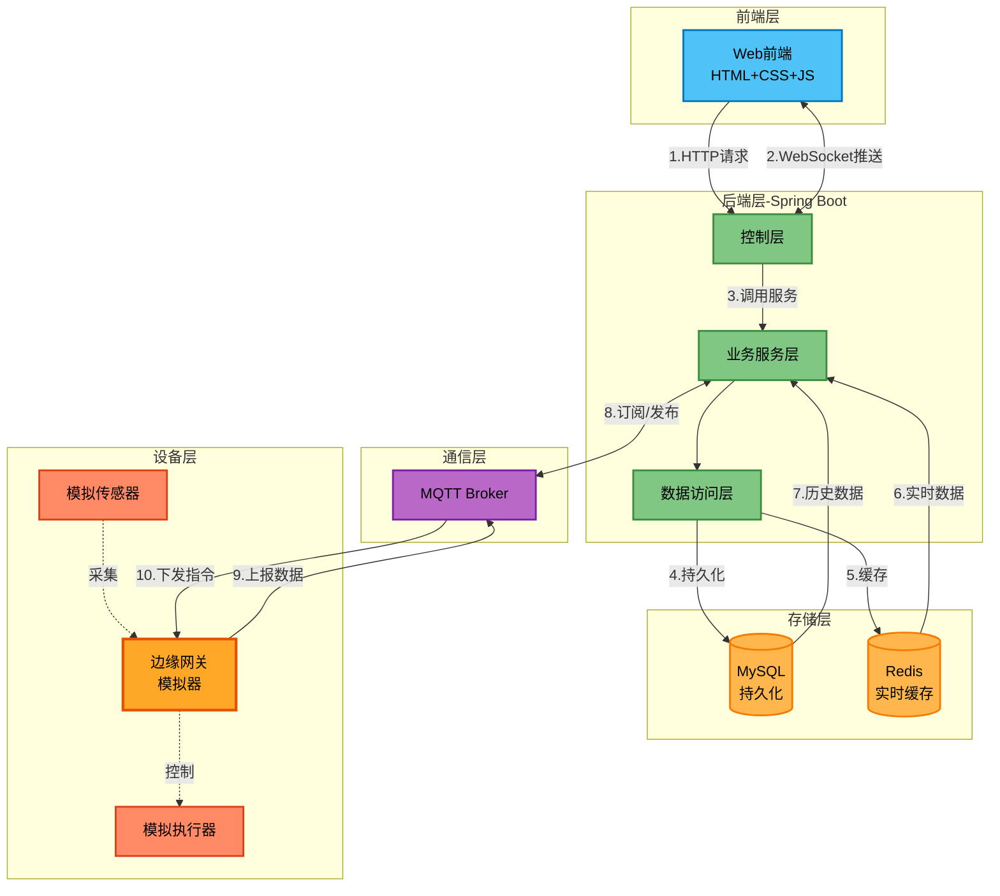
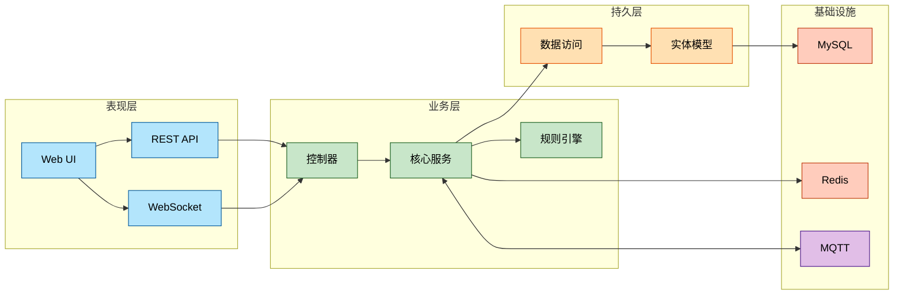
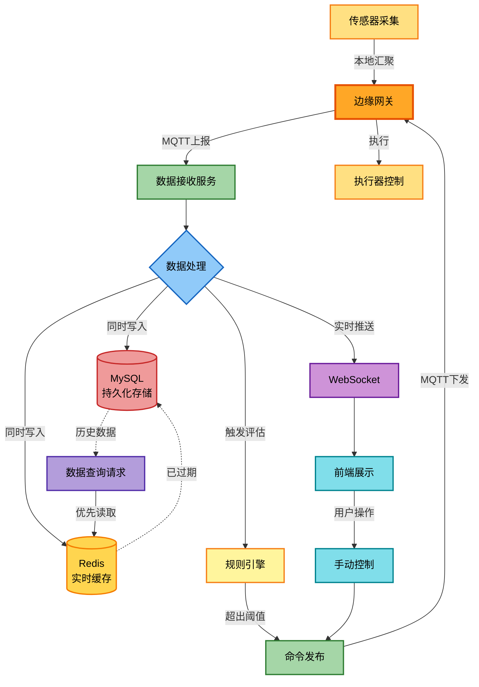
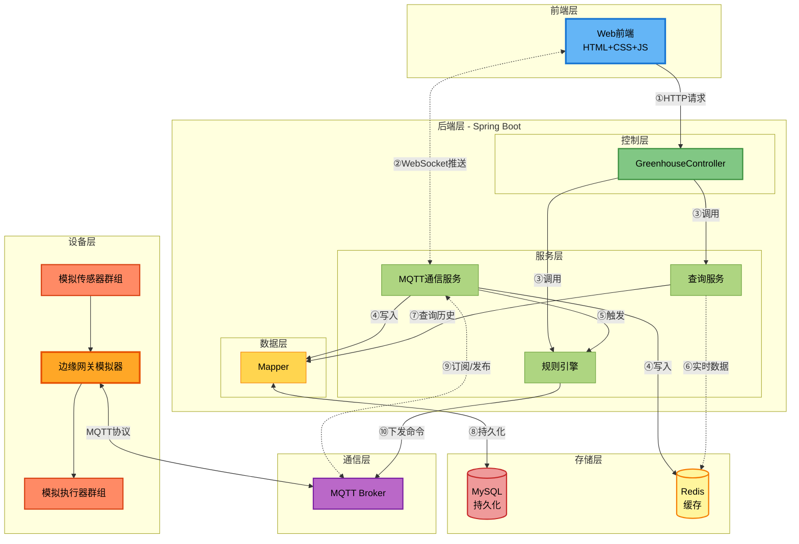
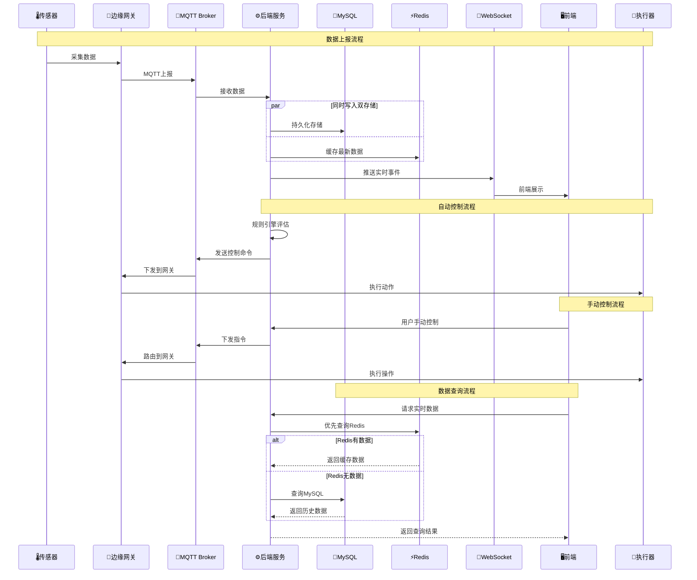
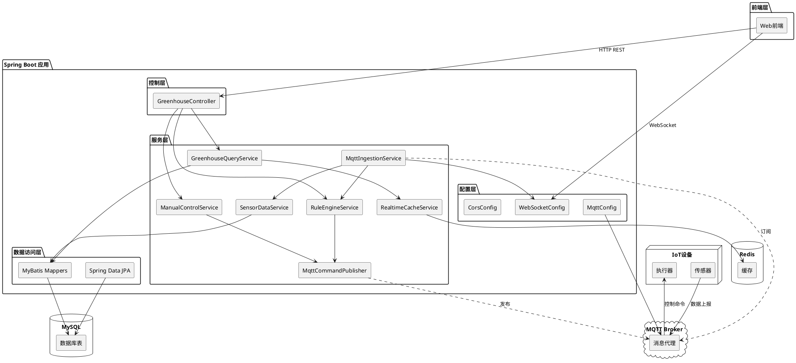

# 智能温室环境监测与控制平台 - 架构文档

## 一、项目架构总览

### 技术栈
- **后端框架**: Spring Boot 3.2.5 + Java 17
- **数据持久化**: Spring Data JPA + MySQL
- **消息通信**: MQTT (Spring Integration MQTT)
- **实时推送**: WebSocket + STOMP
- **缓存**: Redis
- **消息队列**: RabbitMQ
- **前端**: HTML5 + CSS3 + JavaScript (原生)

### 核心功能模块
1. **边缘网关**: 本地汇聚传感器数据，执行器控制中转
2. **实时数据采集**: 通过MQTT接收边缘网关上报的数据
3. **双写存储**: 数据同时写入MySQL（持久化）和Redis（实时缓存）
4. **规则引擎**: 自动化控制执行器
5. **手动控制**: 远程控制执行器
6. **数据查询**: 优先从Redis读取实时数据，从MySQL查询历史数据
7. **实时推送**: WebSocket推送实时事件到前端

---

## 二、系统架构图 (Mermaid)

### 2.1 极简架构图 ⭐ 推荐



### 2.2 分层架构图（简化版）



### 2.3 核心业务流程图



### 2.4 详细架构图（完整版）

<details>
<summary>点击展开查看详细架构图</summary>



</details>

---

### 💡 推荐使用建议
- **演示/PPT**: 使用 2.1 极简架构图（包含边缘网关）
- **文档说明**: 使用 2.2 分层架构图
- **业务理解**: 使用 2.3 核心业务流程图（展示边缘网关作用）
- **数据流向**: 使用 2.5 时序图（展示完整数据流程）
- **技术深入**: 展开 2.4 详细架构图

### 📋 数据流向说明（重要）

**2.1 极简架构图中的序号含义：**
1. **①② 前端请求**: HTTP请求接口数据，WebSocket接收实时推送
2. **③ 服务调用**: Controller调用具体的业务服务
3. **④a 持久化写入**: 通过Mapper将数据写入MySQL
4. **④b 缓存写入**: 同时将最新数据写入Redis（异步）
5. **⑤ 优先读缓存**: 查询时优先从Redis读取
6. **⑥ 缓存失效**: Redis没有数据时从MySQL查询
7. **⑦ MQTT通信**: 订阅设备数据，发布控制命令
8. **⑧ 数据上报**: 边缘网关汇聚数据上报云端
9. **⑨ 指令下发**: 云端控制命令下发到边缘网关

### 🔌 边缘网关说明
**EdgeGatewaySimulator（边缘网关模拟器）** 在系统中的作用：
- 📊 **数据汇聚**: 本地收集多个传感器的数据，统一上报到云端
- 🎯 **协议转换**: 将传感器数据转换为MQTT消息格式
- ⚡ **指令分发**: 接收云端控制命令，分发到对应的执行器
- 🔄 **离线缓存**: 网络断开时可本地缓存数据（模拟器暂未实现）
- 🚀 **边缘计算**: 可在网关侧进行简单的规则判断（未来扩展）

### 💾 数据存储策略说明
**MySQL与Redis的配合使用**：

**写入策略**（数据接收时）：
- ✅ **同时写入MySQL**: 所有传感器数据持久化存储，用于历史数据查询和分析
- ✅ **同时写入Redis**: 缓存最新的实时数据（如最近1小时的数据），设置过期时间

**读取策略**（数据查询时）：
- 🔍 **实时数据查询**: 优先从Redis读取，速度快，适合大屏展示
- 📊 **历史数据查询**: 从MySQL读取，支持时间范围筛选、聚合分析
- ⚡ **缓存失效**: Redis中没有数据时，回退到MySQL查询

**优势**：
- 🚀 实时查询性能高（Redis内存访问）
- 💪 数据安全可靠（MySQL持久化）
- 📈 支持复杂的历史数据分析（MySQL关系型查询）

### 2.5 数据流向图（时序图）



---

## 三、PlantUML架构图

### 3.1 类图 (Class Diagram)

```plantuml
@startuml
skinparam classAttributeIconSize 0
skinparam backgroundColor #FEFEFE

package "Controller层" {
    class GreenhouseController {
        - greenhouseQueryService: GreenhouseQueryService
        - manualControlService: ManualControlService
        - manualModeService: ManualModeService
        - ruleEngineService: RuleEngineService
        + getGreenhouseList(): List<GreenhouseSummaryDto>
        + getGreenhouseDetail(id): GreenhouseDetailDto
        + getSensorHistory(): List<SensorHistoryDto>
        + executeManualCommand(request): ResponseEntity
        + switchManualMode(request): ResponseEntity
        + batchUpdateRuleRanges(request): ResponseEntity
    }
}

package "Service层" {
    class GreenhouseQueryService {
        + getAllGreenhouses(): List<GreenhouseSummaryDto>
        + getGreenhouseDetail(id): GreenhouseDetailDto
        + getSensorHistory(): List<SensorHistoryDto>
    }
    
    class MqttIngestionService {
        - sensorDataService: SensorDataService
        - messagingTemplate: SimpMessagingTemplate
        + handleMessage(message): void
    }
    
    class MqttCommandPublisher {
        + publishActuatorCommand(command): void
    }
    
    class ManualControlService {
        + executeCommand(request): void
    }
    
    class RuleEngineService {
        + evaluateRules(sensorData): void
        + updateRuleRanges(request): void
    }
    
    class SensorDataService {
        + saveSensorData(data): void
    }
    
    class RealtimeCacheService {
        + updateCache(data): void
        + getRealtimeData(): Map
    }
}

package "Mapper层" {
    interface GreenhouseMapper
    interface SensorMapper
    interface SensorDataMapper
    interface ActuatorMapper
    interface ActuatorCommandMapper
    interface RuleRangeMapper
    interface ManualModeMapper
}

package "Entity层" {
    class GreenhouseEntity {
        - id: Long
        - name: String
        - location: String
    }
    
    class SensorEntity {
        - id: Long
        - greenhouseId: Long
        - sensorType: String
        - deviceId: String
    }
    
    class SensorDataEntity {
        - id: Long
        - sensorId: Long
        - value: Double
        - timestamp: Instant
    }
    
    class ActuatorEntity {
        - id: Long
        - greenhouseId: Long
        - actuatorType: String
        - deviceId: String
    }
    
    class RuleRangeEntity {
        - id: Long
        - greenhouseId: Long
        - sensorType: String
        - minValue: Double
        - maxValue: Double
    }
}

package "Config层" {
    class MqttConfig {
        + mqttClientFactory(): MqttPahoClientFactory
        + mqttInboundChannel(): MessageChannel
        + mqttOutboundChannel(): MessageChannel
    }
    
    class WebSocketConfig {
        + registerStompEndpoints(): void
    }
    
    class CorsConfig {
        + corsFilter(): CorsFilter
    }
}

GreenhouseController --> GreenhouseQueryService
GreenhouseController --> ManualControlService
GreenhouseController --> RuleEngineService

GreenhouseQueryService --> GreenhouseMapper
GreenhouseQueryService --> SensorDataMapper
GreenhouseQueryService --> RealtimeCacheService

MqttIngestionService --> SensorDataService
MqttIngestionService --> RuleEngineService

ManualControlService --> MqttCommandPublisher
ManualControlService --> ActuatorMapper

RuleEngineService --> RuleRangeMapper
RuleEngineService --> MqttCommandPublisher

SensorDataService --> SensorDataMapper

GreenhouseMapper ..> GreenhouseEntity
SensorMapper ..> SensorEntity
SensorDataMapper ..> SensorDataEntity
ActuatorMapper ..> ActuatorEntity
RuleRangeMapper ..> RuleRangeEntity

@enduml
```



### 3.2 组件图 (Component Diagram)



---

## 四、可视化工具使用指南

### 📱 方法1: 在线快速预览（最简单）⭐

**Mermaid在线编辑器:**
1. 访问: https://mermaid.live/
2. 删除默认代码
3. 复制本文档中的 Mermaid 代码（包括 \`\`\`mermaid 到 \`\`\`）
4. 粘贴到编辑器
5. 自动生成精美图表
6. 点击右上角下载按钮导出 PNG/SVG

**PlantUML在线编辑器:**
1. 访问: http://www.plantuml.com/plantuml/uml/
2. 粘贴 PlantUML 代码（从 @startuml 到 @enduml）
3. 点击 "Submit" 
4. 右键保存生成的图片

---

### 💻 方法2: VS Code本地预览

**安装插件:**
- Mermaid: 搜索安装 "Markdown Preview Mermaid Support"
- PlantUML: 搜索安装 "PlantUML"

**使用方法:**
1. 在 VS Code 中打开本 MD 文件
2. 按 `Ctrl+Shift+V` 打开 Markdown 预览
3. Mermaid 图自动渲染
4. PlantUML 需要按 `Alt+D` 单独预览

---

### 🌐 方法3: GitHub/GitLab直接查看

将本文件上传到 GitHub 或 GitLab，系统会自动渲染所有 Mermaid 图表，无需任何配置。

---

### 🎨 方法4: 导出为图片

**推荐流程:**
1. 在 https://mermaid.live/ 打开
2. 粘贴代码
3. 调整缩放比例
4. 点击 "Actions" → "Download PNG/SVG"
5. 嵌入到 PPT、Word 文档中

**图表质量建议:**
- PPT 演示: 导出为 PNG (高分辨率)
- 矢量编辑: 导出为 SVG
- 文档嵌入: 导出为 PNG 或直接用 Markdown

## 五、架构图使用场景推荐

| 场景 | 推荐图表 | 说明 |
|------|---------|------|
| 🎯 **毕业答辩PPT** | 2.1 极简架构图 | 清晰直观，一目了然 |
| 📖 **技术文档** | 2.2 分层架构图 | 展示系统分层设计 |
| 💡 **业务讲解** | 2.3 核心业务流程图 | 说明数据流转过程 |
| 📝 **开发交流** | 2.4 详细架构图 | 精确到类级别 |
| ⏱️ **时序说明** | 2.5 数据流向图 | 展示时间顺序 |
| 🏗️ **UML建模** | PlantUML 类图/组件图 | 符合UML标准 |

---

## 六、项目架构核心要点

## 六、项目架构核心要点

### 6.1 四层架构设计

```
┌─────────────────────────────────────┐
│  表现层 (Presentation)              │  ← Web前端 + REST API + WebSocket
├─────────────────────────────────────┤
│  业务层 (Business)                  │  ← Service服务 + 规则引擎
├─────────────────────────────────────┤
│  持久层 (Persistence)               │  ← Mapper接口 + Entity实体
├─────────────────────────────────────┤
│  基础设施 (Infrastructure)          │  ← MySQL + Redis + MQTT
└─────────────────────────────────────┘
```

### 6.2 关键技术点

- ✅ **边缘网关**: 本地汇聚传感器数据，实现设备统一管理
- ✅ **双写策略**: 数据同时写入MySQL（持久化）和Redis（实时缓存）
- ✅ **读取优化**: 优先从Redis读取实时数据，降低数据库压力
- ✅ **分层解耦**: Controller → Service → Mapper → Entity
- ✅ **依赖注入**: Spring IoC容器管理所有Bean
- ✅ **MQTT通信**: Spring Integration实现IoT设备对接
- ✅ **实时推送**: WebSocket + STOMP协议
- ✅ **规则引擎**: 基于阈值的自动化控制
- ✅ **前后端分离**: RESTful API设计

### 6.3 核心设计模式

| 设计模式 | 应用场景 |
|---------|---------|
| 分层架构模式 | 整体系统结构 |
| 依赖注入模式 | 组件管理 |
| DTO模式 | 数据传输 |
| 观察者模式 | MQTT订阅/发布 |
| 策略模式 | 规则引擎动态评估 |

---

## 七、目录结构映射

```
backend/
├── 📁 config/          → ⚙️ 配置层（MQTT、WebSocket、CORS）
├── 📁 controller/      → 🎮 控制层（REST API入口）
├── 📁 service/         → 💼 业务逻辑层（核心服务）
├── 📁 Mapper/          → 🗄️ 数据访问层（数据库操作）
├── 📁 Entity/          → 📦 实体层（领域模型）
├── 📁 dto/             → 📨 数据传输对象
├── 📁 simulation/      → 🔧 边缘网关模拟器
└── 📁 resources/       → 📋 配置文件

frontend/
└── 📄 index.html       → 🖥️ 单页Web应用
```

---

## 八、快速开始指南

### 查看架构图最快方式：

1. **在线查看（无需安装）**
   ```
   → 访问 https://mermaid.live/
   → 复制本文档中的 2.1 极简架构图代码
   → 粘贴到编辑器
   → 立即看到精美图表！
   ```

2. **VS Code查看（推荐开发者）**
   ```
   → 安装 "Markdown Preview Mermaid Support" 插件
   → 打开本 MD 文件
   → 按 Ctrl+Shift+V 预览
   → 所有图表自动渲染！
   ```

3. **GitHub查看（最简单）**
   ```
   → 将本文件上传到 GitHub
   → 直接在线查看
   → 自动渲染所有 Mermaid 图！
   ```

---

## 九、常见问题 FAQ

**Q: 哪个架构图最适合答辩？**  
A: 推荐使用 2.1 极简架构图 + 2.3 核心业务流程图，清晰直观。

**Q: 边缘网关的作用是什么？**  
A: 边缘网关负责汇聚本地传感器数据、统一上报云端、接收控制命令并分发给执行器，是传感器/执行器与云端的桥梁。

**Q: MySQL和Redis是如何配合使用的？**  
A: 数据接收时**同时写入**MySQL（持久化）和Redis（实时缓存）。查询时**优先从Redis读取**实时数据，历史数据分析则从MySQL查询。这样既保证了实时性能，又保证了数据安全。

**Q: 为什么要同时写入两个数据库？**  
A: MySQL用于持久化存储和复杂查询（如历史数据分析），Redis用于快速访问最新数据（如大屏实时展示）。各司其职，性能最优。

**Q: 如何导出高清图片？**  
A: 在 https://mermaid.live/ 中打开图表，点击右上角下载为 PNG（推荐 2x 或 3x 分辨率）。

**Q: Mermaid 图在 VS Code 中不显示？**  
A: 需要安装 "Markdown Preview Mermaid Support" 插件，然后重启 VS Code。

**Q: 能否自定义图表颜色？**  
A: 可以！修改代码中的 `style` 行，更改 `fill` 颜色值。

**Q: 图表太大怎么办？**  
A: 使用 2.1 极简版或 2.2 分层版，或在导出时调整缩放比例。

**Q: 后端服务层包括哪些核心服务？**  
A: 主要包括查询服务、MQTT通信服务、规则引擎3个核心服务，职责清晰，易于维护。

---

*本文档生成于 2026-03-12*
*项目: 智能温室环境监测与控制平台*
