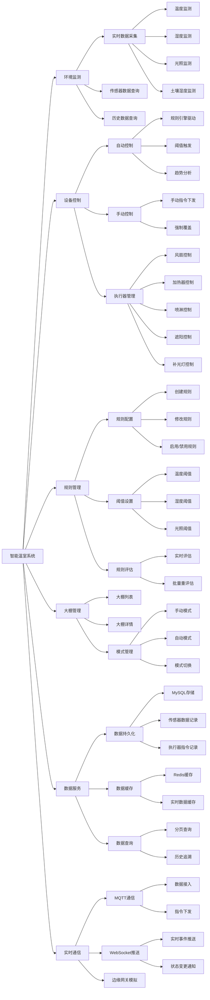
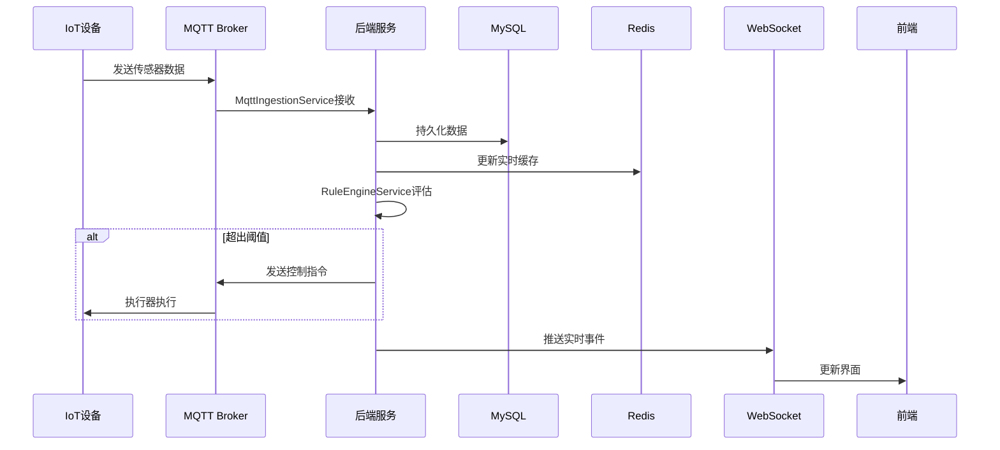

# 智能温室环境监测与控制平台 - 系统功能树状图

## 功能架构图（横向树状结构）

## 技术组件映射

### 后端服务层
- **MqttIngestionService**: MQTT数据接入、传感器数据解析
- **SensorDataService**: 传感器数据处理、持久化
- **RealtimeCacheService**: 实时数据缓存管理
- **RuleEngineService**: 规则引擎、阈值判断、自动控制决策
- **MqttCommandPublisher**: 执行器指令下发
- **ManualControlService**: 手动控制服务
- **ManualModeService**: 手动/自动模式切换
- **GreenhouseQueryService**: 大棚信息查询

### 数据层
- **MySQL**: 持久化存储（传感器数据、执行器指令、规则配置等）
- **Redis**: 实时数据缓存

### 通信层
- **MQTT Broker**: 物联网设备通信
- **WebSocket**: 前端实时数据推送

## API 端点概览

| 功能模块 | API 端点 | 说明 |
|---------|----------|------|
| 大棚管理 | GET /api/greenhouses | 获取大棚列表 |
| 大棚管理 | GET /api/greenhouses/{id} | 获取大棚详情 |
| 模式管理 | POST /api/greenhouses/{id}/manual-mode | 切换手动/自动模式 |
| 手动控制 | POST /api/greenhouses/{id}/actuators/{actuatorId}/manual-command | 发送手动控制指令 |
| 规则管理 | GET /api/greenhouses/{id}/rules | 获取规则配置 |
| 规则管理 | POST /api/greenhouses/{id}/rules/batch | 批量更新规则 |
| 历史查询 | GET /api/greenhouses/{id}/sensors/{sensorId}/history | 查询传感器历史数据 |

## 数据流向

## 核心业务流程

### 1. 自动控制流程
1. 传感器通过MQTT发送数据到Broker
2. MqttIngestionService接收并解析数据
3. SensorDataService持久化到MySQL
4. RealtimeCacheService更新Redis缓存
5. RuleEngineService根据规则评估当前环境
6. 若超出阈值，MqttCommandPublisher下发控制指令
7. WebSocket推送状态变更到前端

### 2. 手动控制流程
1. 用户在前端切换到手动模式
2. ManualModeService更新模式状态
3. 用户发送手动控制指令
4. ManualControlService验证并下发指令
5. MqttCommandPublisher通过MQTT发送到设备
6. WebSocket推送执行结果到前端

### 3. 规则配置流程
1. 用户在前端配置规则阈值
2. Controller接收并验证数据
3. RuleRangeMapper更新规则到MySQL
4. RuleEngineService重新评估所有传感器数据
5. 根据新规则调整执行器状态
6. WebSocket推送变更通知
